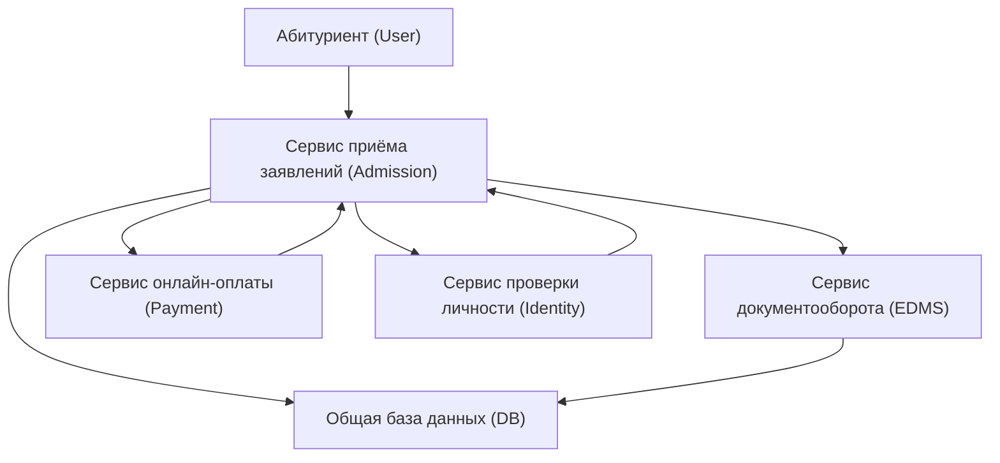

# Проектирование API-интеграции: Онлайн-зачисление

## 📌 Ключевые точки создания ценности
- Мгновенная проверка документов и подтверждение для абитуриента
- Автоматическое создание заявления и личного дела без ручного ввода
- Уведомление абитуриента о статусе (почта/СМС) в реальном времени
- Автоматическое создание учётной записи во всех системах ВУЗа после зачисления

## 🛠 Сервисы и их роли
- **Портал для абитуриента** — интерфейс подачи заявления
- **Сервис приёма заявлений (Admission)** — центральный модуль приёмной кампании
- **Сервис проверки личности (Identity)** — верификация данных абитуриента
- **Сервис документооборота (EDMS)** — хранение и обработка электронных документов
- **Сервис онлайн-оплаты (Payment)** — приём госпошлины и прочих платежей
- **Общая база данных (DB)** — единый источник данных для всех систем

## 🔄 Схема потоков данных

